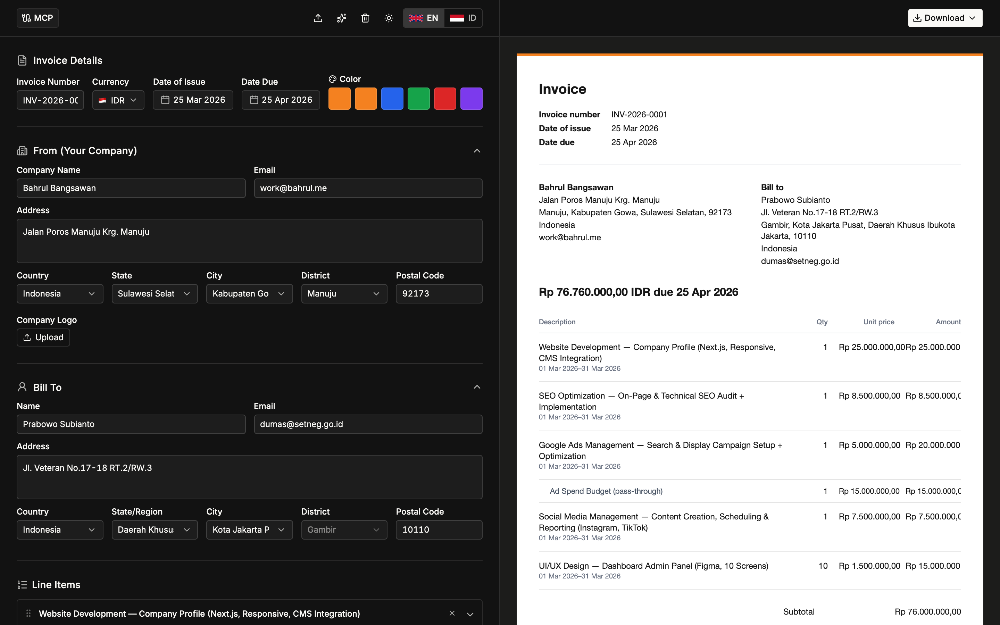

# invoice-gen

Free bilingual invoice generator with a split editor, live print-faithful preview, PDF/JSON export, Indonesian address data, and MCP so any AI assistant can create or update invoices. No sign-up. Data stays in the browser unless you opt into cloud save.

**Live:** [invoice.bahrul.me](https://invoice.bahrul.me) · [Bahasa Indonesia](https://invoice.bahrul.me/id)



## Features

### Editor

- Split layout: form on the left, live invoice preview on the right (stacked on mobile)
- **Invoice details** — number, currency, issue date, due date, accent color
- **From / Bill to** — company or client name, email, street address, country, region, city, postal code, optional company logo
- **Indonesian address cascade** — when country is Indonesia, province → kabupaten/kota → kecamatan comboboxes load from built-in [wilayah](https://github.com/cahyadsn/wilayah) JSON (38 provinces, lazy-loaded per province)
- **Line items** — description, service period, qty, unit price, computed amount; nested sub-items; drag-and-drop reorder
- **Adjustments** — add or deduct, fixed amount or percent of subtotal (service charge, discount, down payment, etc.)
- **Custom fields + notes** — NPWP, bank details, payment terms, or any label/value pair
- Logo upload is resized to 320px on the long edge (PNG alpha preserved) before embed
- Light / dark theme (Warp design system; the invoice document itself stays ink-on-paper)

### Preview, PDF, and JSON

- Preview updates as you type; empty state until the form has a company name or a line item
- **Download as PDF** — `@react-pdf/renderer` document, filename `Invoice-<number>-YYYYMMDD.pdf`
- **Download as JSON** — full `InvoiceData` snapshot for backup or re-import
- **Import JSON** — restore a previous export
- **Load sample** — fills the form with a complete IDR invoice
- **Print view** — `?print=1` renders the same preview without chrome and auto-prints (used when MCP 302s to `/invoice/<slug>.pdf`)

### Persistence

- Scratch invoices autosave to `localStorage` (`invoice-data`)
- Optional cloud save: paste a personal MCP token, then open `?id=<slug>` (alias `?invoice=`) to load/save against [mcp.bahrul.me](https://mcp.bahrul.me)
- Owner-authenticated optimistic PUT; non-owners get 403 and editing is disabled
- Saving / saved / error status in the preview toolbar when a slug + token are present

### Language and MCP

- English (`/`) and Bahasa Indonesia (`/id`), with `hreflang` + sitemap
- MCP dialog walks through token generation and client setup (Claude Code, Cursor, Codex, Windsurf, Zed, …)
- Ask an assistant to “create an invoice” or “update line items” once the client is connected

### Currencies

USD, EUR, GBP, IDR, SGD, AUD, JPY, MYR — formatted with the matching `Intl` locale.

## Getting started

Requires [Bun](https://bun.sh) `1.4+` (see `packageManager` in `package.json`).

```bash
bun install
bun run dev
```

App: [http://localhost:5003](http://localhost:5003)

In development, cloud save / invoice load talks to `http://localhost:8787` (local MCP worker). Production uses `https://mcp.bahrul.me`.

## Scripts

| Script | What it does |
| --- | --- |
| `bun run dev` | Vite + TanStack Start on port **5003** |
| `bun run build` | Production build (`NODE_OPTIONS=--max-old-space-size=4096`) |
| `bun run preview` | Preview the production build |
| `bun run test` | Vitest once |
| `bun run lint` | ESLint |
| `bun run format` | Prettier on `ts`/`tsx`/`js`/`jsx` |
| `bun run typecheck` | `tsc --noEmit` |
| `bun run deploy` | `wrangler deploy` (Cloudflare Worker `invoice-gen`) |

## Invoice data

Canonical shape (`src/components/invoice-form-utils.ts`):

```ts
interface InvoiceData {
  invoiceNumber: string
  dateOfIssue: string       // ISO yyyy-MM-dd
  dateDue: string
  currency: string
  accentColor: string
  from: SenderInfo          // company, address, email, logoUrl, …
  billTo: RecipientInfo
  items: InvoiceLineItem[]  // + period, subItems[]
  adjustments: InvoiceAdjustment[]  // add | deduct, percentage | fixed
  customFields: InvoiceCustomField[]
  notes: string
  taxRate: number           // percent; rendered when > 0 (JSON/MCP)
}
```

Dates are stored as ISO `yyyy-MM-dd`. Display accepts legacy `dd MMM yyyy`, `dd-MM-yyyy`, and `MM/dd/yyyy`. Line totals are computed as `qty × unitPrice + Σ sub-items` — the stored `amount` is not trusted.

Sample document: `src/data/sample-invoice.json`.

## URL parameters

| Param | Route | Meaning |
| --- | --- | --- |
| *(none)* | `/`, `/id` | Scratch editor (localStorage) |
| `?id=<slug>` | `/`, `/id` | Load/edit a cloud invoice |
| `?invoice=<slug>` | `/`, `/id` | Legacy alias of `id` |
| `?print=1` | `/`, `/id` | Chrome-free print/PDF view |

Unknown paths render a 404 (`defaultNotFoundComponent` + `/$` catch-all).

## Design

Editor chrome follows **Warp** — warm near-black canvas, Matter/Inter + Geist Mono, 4px controls / 8px cards. The invoice page is a light “paper” island so print and PDF stay print-faithful regardless of theme.

Tokens and rules: [`DESIGN.md`](DESIGN.md).

## Tech stack

| Layer | Choice |
| --- | --- |
| Framework | [TanStack Start](https://tanstack.com/start) + [TanStack Router](https://tanstack.com/router) |
| UI | React 19, [`@rulisme/ui`](https://www.npmjs.com/package/@rulisme/ui), shadcn, Tailwind CSS v4 |
| PDF | [`@react-pdf/renderer`](https://react-pdf.org) |
| Drag and drop | `@dnd-kit` |
| Theme | `next-themes` |
| Runtime | [Bun](https://bun.sh), Vite 8 |
| Host | [Cloudflare Workers](https://workers.cloudflare.com) (`wrangler.jsonc` → worker name `invoice-gen`) |

## Project layout

```
src/
  components/          Form, preview, PDF, 404, theme toggle
  data/                Sample invoice, countries, wilayah JSON
  i18n/                en / id strings + language switcher
  lib/                 Cloud save, image preprocess, OG URL
  routes/              `/`, `/id`, `/$`, root shell
  styles.css           Warp tokens + print rules
scripts/parse-wilayah.ts   Rebuild province JSON from wilayah SQL
public/                Favicons, OG image, robots.txt, sitemap.xml, llms.txt
docs/screenshot.png    README screenshot
```

## Deploy

```bash
bun run deploy
```

Worker name: `invoice-gen`. Production origin: `https://invoice.bahrul.me`.

## Author

[Bahrul Bangsawan](https://bahrul.me) · [GitHub](https://github.com/bahrulbangsawan) · [LinkedIn](https://www.linkedin.com/in/bahrulbangsawan)
